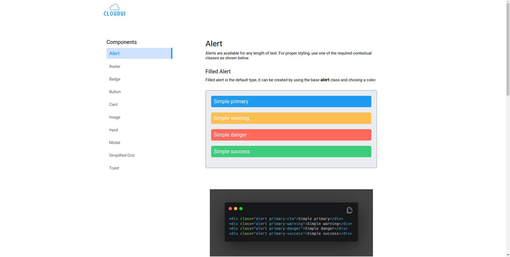
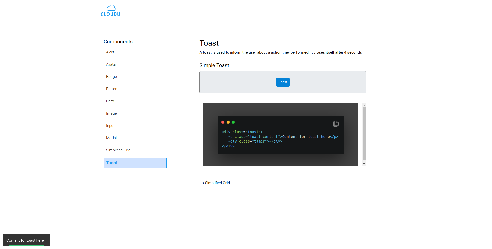

# Cloud UI

## Description-

Cloud UI is a lightweight CSS library which provides an effortless way to design web pages without worrying about consistency and responsiveness.

## Technologies Used -

- HTML
- CSS
- JAVASCRIPT

## How to use?

Copy paste the following links in your html and you are ready to go.

### CSS

Paste be below link in the `<head>` section

```html
<link
  rel="stylesheet"
  href="https://cloud-uii.netlify.app/css/components.css"
/>
```

### JS

To ensure proper working of some components add the below code above closing `<body>` tag

```html
<link rel="stylesheet" href="https://cloud-uii.netlify.app/js/main.js" />
```

## Components included

- Avatar
- Alert
- Badge
- Button
- Card
- Image
- Input
- Modal
- Simplified Grid
- Toast

## Live Link -

Documentation for [CloudUI](https://cloud-uii.netlify.app/)

## ScreenShots -




